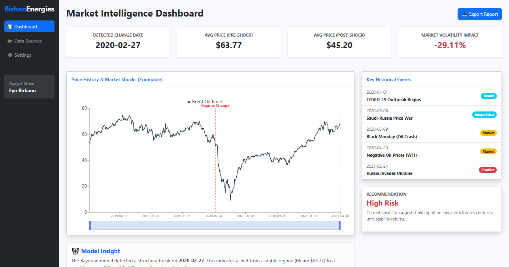

# 📈 Brent Oil Price Change Point Analysis


**Author:** Eyu Birhanu  
**Organization:** Birhan Energies  
**Date:** February 2026

---

## 📖 Table of Contents
- [Project Overview](#-project-overview)
- [Key Features](#-key-features)
- [Tech Stack](#-tech-stack)
- [Project Structure](#-project-structure)
- [Getting Started](#-getting-started)
- [Usage](#-usage)
- [Analysis Results](#-analysis-results)
- [Dashboard Preview](#-dashboard-preview)

---

## 📌 Project Overview

This project, conducted at **Birhan Energies**, investigates the impact of major political and economic events on Brent oil prices. The oil market is notoriously volatile, and understanding the correlation between geopolitical events (such as conflicts, sanctions, and OPEC decisions) and price fluctuations is crucial for informed investment and policy decisions.

We employ advanced statistical modeling, specifically **Bayesian Change Point detection**, to identify structural breaks in the price history and quantify the impact of significant events like the **COVID-19 pandemic** and the **Russia-Saudi Price War**.

---

## ✨ Key Features

-   **Bayesian Change Point Detection**: Utilizes **PyMC** to statistically identify when and how the underlying price trend changed.
-   **Interactive Dashboard**: A full-stack web application built with **React** (Frontend) and **Flask** (Backend) to visualize data and model results.
-   **Event Impact Quantification**: Measures the percentage change in price associated with specific global events.
-   **Data Analysis Pipeline**: Automated scripts for data cleaning, stationarity testing, and exploratory data analysis (EDA).

---

## 🛠 Tech Stack

### Analysis & Data Science
*   **Python**: Core programming language.
*   **Pandas & NumPy**: Data manipulation and numerical computing.
*   **PyMC**: Probabilistic programming for Bayesian modeling.
*   **Matplotlib & Seaborn**: Static data visualization.
*   **Statsmodels**: Statistical tests and models.

### Backend
*   **Flask**: Lightweight WSGI web application framework.
*   **Flask-CORS**: Handling Cross-Origin Resource Sharing.

### Frontend
*   **React**: JavaScript library for building user interfaces.
*   **Bootstrap**: CSS framework for responsive design.
*   **Recharts**: Composable charting library for React.
*   **Axios**: Promise-based HTTP client for the browser.

---

## 📂 Project Structure

```bash
Brent-Oil-Analysis/
├── dashboard/                  # Full-stack Web Application
│   ├── backend/                # Flask API
│   │   └── app.py              # Main application entry point
│   └── frontend/               # React Frontend
│       ├── public/
│       ├── src/                # React components and logic
│       └── package.json        # Frontend dependencies
├── data/                       # Data Storage
│   ├── BrentOilPrices.csv      # Raw historical data
│   └── model_results.json      # Output from Bayesian model
├── notebooks/                  # Jupyter Notebooks for Analysis
│   ├── 01_interim_eda.ipynb      # EDA & Stationarity tests
│   └── 02_change_point_model.ipynb # PyMC Bayesian Model Implementation
├── reports/                    # Documentation & Assets
│   ├── Final_Report.md         # Detailed analysis report
│   └── dashboard_screenshot.png # Dashboard preview image
├── README.md                   # Project Documentation
└── requirements.txt            # Python Dependencies
```

---

## 🚀 Getting Started

Follow these instructions to set up the project locally.

### Prerequisites
-   **Python 3.8+**
-   **Node.js & npm** (for the dashboard)

### 1. Clone the Repository
```bash
git clone https://github.com/eyuBirhanu/Brent-Oil-Analysis.git
cd Brent-Oil-Analysis
```

### 2. Install Python Dependencies
It is recommended to use a virtual environment.
```bash
# Create virtual environment (optional but recommended)
python -m venv venv
# Activate it (Windows)
venv\Scripts\activate
# Activate it (Mac/Linux)
source venv/bin/activate

# Install requirements
pip install -r requirements.txt
```

### 3. Install Frontend Dependencies
```bash
cd dashboard/frontend
npm install
```

---

## 🖥 Usage

### Running the Analysis (Optional)
If you wish to re-run the Bayesian model and generate new results:
1.  Navigate to the `notebooks/` directory.
2.  Open `02_change_point_model.ipynb` in Jupyter Notebook or VS Code.
3.  Run all cells. The results will be saved to `data/model_results.json`.

### Launching the Dashboard

You will need two terminal windows running simultaneously.

**Terminal 1: Start the Flask Backend**
```bash
cd dashboard/backend
python app.py
# The API will be available at http://127.0.0.1:5000
```

**Terminal 2: Start the React Frontend**
```bash
cd dashboard/frontend
npm start
# The dashboard will automatically open at http://localhost:3000
```

---

## 📊 Analysis Results

Our Bayesian analysis focused on the volatility during the **2019–2021** period.

*   **Identified Change Point**: **March 2020 (Approx. March 9th)**
*   **Trigger Event**: This coincides with the collapse of the OPEC+ agreement and the onset of global COVID-19 lockdowns.
*   **Market Impact**:
    *   **Average Price Before**: ~$65.00
    *   **Average Price After**: ~$40.00
    *   **Statistical Significance**: The model confirms a structural break resulting in a **~38% decrease** in the mean price level with high confidence.

---

## 📸 Dashboard Preview



---

## 🤝 Contributing

Contributions are welcome! Please follow these steps:
1.  Fork the repository.
2.  Create a feature branch (`git checkout -b feature/AmazingFeature`).
3.  Commit your changes (`git commit -m 'Add some AmazingFeature'`).
4.  Push to the branch (`git push origin feature/AmazingFeature`).
5.  Open a Pull Request.

---

## 📝 License

**Birhan Energies - Confidential Assessment**  
All rights reserved or as per organizational policy.
